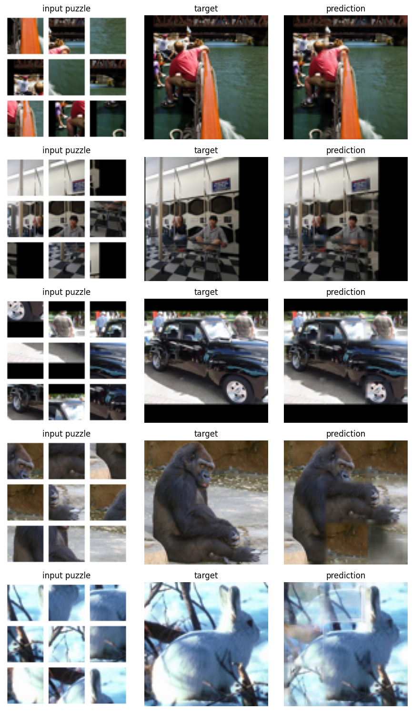

# Neural Jigsaw Image Reconstruction

Reconstruction of 96×96 RGB images from nine shuffled and spatially eroded image patches using an end-to-end neural network.

## Problem

The input consists of nine 28×28 RGB patches originating from a 3×3 partition of an image. Their original spatial arrangement is unknown, and part of the border information is removed.

The goal is to reconstruct the original 96×96 image by learning both the spatial relationships between patches and the missing visual content.

## Approach

The proposed architecture combines:

- a shared convolutional encoder for patch feature extraction;
- transformer-style self-attention to model relationships between patches;
- nine learned grid queries representing the target 3×3 positions;
- attention between grid queries and encoded patches;
- a convolutional upsampling decoder for full-image reconstruction;
- an attention-based patch canvas and visible-patch mask.

The model is trained end-to-end using Mean Absolute Error (MAE).

## Constraints

The project was developed under the following constraints:

- neural-network-only solution;
- no pretrained models;
- fewer than 6 million trainable parameters;
- implementation in Keras;
- evaluation using MAE.

## Dataset

The model is trained and evaluated using the STL-10 image dataset, containing 96×96 RGB images from 10 object categories.

## Results

The final model was evaluated on the STL-10 test set containing 10,000 images.

- **Test MAE:** 0.0489
- **Standard deviation:** 0.0499
- **Baseline MAE:** 0.1823
- **Trainable parameters:** 2,019,859

The model substantially improves over the mean-patch baseline while remaining well below the 6 million trainable-parameter constraint.

### Reconstruction examples

## Technologies

Python · TensorFlow · Keras · NumPy · Matplotlib

## Notebook

The complete implementation, training procedure, evaluation, and qualitative results are available in [`neural_jigsaw_reconstruction.ipynb`](neural_jigsaw_reconstruction.ipynb).